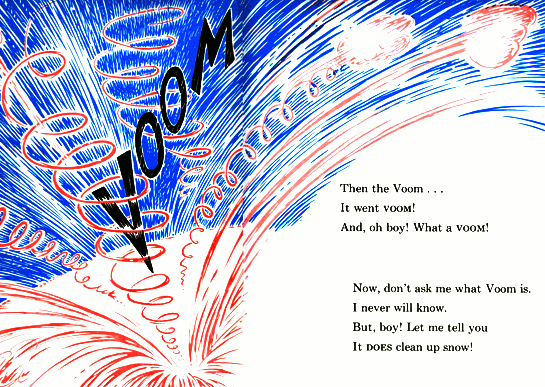

# lein-voom



_— Dr. Seuss, ["The Cat in the Hat Comes Back"](http://youtu.be/TWMOqUC1JXQ?t=12m10s)_

lein-voom is a Leiningen plugin that helps you clean up your dependency tree.

## Usage [TL;DR]

Use this for user-level plugins:

Put `[lein-voom "0.1.0-20171223_184737-g8fc284c"]` into the `:plugins` vector of your
`:user` profile, or if you are on Leiningen 1.x do `lein plugin install
voom 0.1.0-20171223_184737-g8fc284c`.

Annotate your voom dependencies in your ```project.clj```. For example:
```clojure
^{:voom {:repo "https://github.com/ring-clojure/ring" :branch "1.3"}}
[ring/ring-core "1.2.3"]
```

When building and deploying, insert `voom` before the task:

    $ lein voom install

If your project includes voom-version dependencies, use
`voom build-deps` instead of just `deps`:

    $ lein voom build-deps

To update your `project.clj` to use the latest versions of your dependencies:

    $ lein voom freshen

After ```voom freshen```, our example dependency in ```project.clj``` has been updated:
```clojure
^{:voom {:repo "https://github.com/ring-clojure/ring" :branch "1.3"}}
[ring/ring-core "1.3.0-RC1-20140519_142204-gaf0379b"]
```

## The scenario:

Multiple git projects with one or more leiningen projects in each, all
under active development by a team.

## Use cases:

- Make changes to a project, working with known good (possibly old)
  versions of dependencies from other git repos.

- Test and push a new version of a project with the very latest
  (possibly unreleased) versions of its dependencies.

- Retrieve exactly the source code used to build every component of a
  specific built artifact.

## A solution:

Most approaches addressing these use cases can be grouped into two
categories: ones that use SNAPSHOT artifacts and ones that don't.
SNAPSHOT versions can make some sense if all related deps are kept in
a single git repo, and care is taken to rebuild from sources whenever
they change, though tracking from a built artifact back to a git
commit can still be problematic. Multiple git repos add more problems,
some of which can be addressed by git submodules. Yet, without putting
git commit sha's in artifact version numbers, interoperating with the
larger world of leiningen dependencies is problematic.

Our solution falls into the second category -- using only non-SNAPSHOT
versions for built artifacts and dependency declarations. The most
straightforward way to do this is to change the declared version in
the `project.clj` with every commit. Unfortunately, forgetting to do
this even once leads to an ambiguity about the duplicated version
number that can cause hard-to-discover problems far down the
dependency tree.

### voom modifier

Instead, we define a command-line modifier `voom` that causes
the project version seen by any task or plugin to be adjusted to
include a time stamp and short git sha. For example, we might install
our project like so:

    $ lein voom install

This would cause the installed artifact to have a version looking
something like:

    1.2.3-20120219_223112-g123abcf
    ^-+-^ ^------+------^  ^--+--^
      |          |            \----- git sha
      |          \------------------ year/month/day/hour/minute/second of commit
      \----------------------------- original semantic version from project.clj

This version string includes the original semantic version for
meaningful human consumption. The timestamp is included for a similar
reason, as well as to maintain good sorting order. The git sha is the
piece we need to track back to a specific commit and, therefore, the
source code used to build it. Note that `voom` will refuse to
operate unless the working copy is clean, to maintain the integrity of
the git sha.

Normally we still use SNAPSHOT as the version declared in the
`project.clj` except perhaps when preparing a real public release, so
that any accidental builds without the use of `voom` produce a
snapshot version that all tools already know to be imprecise.

We then vigilantly refuse to ever name a SNAPSHOT version in any
dependency list. Note that even third-party dependencies that are
available as git repos can be built with `voom` to allow
specific-version dependencies instead of imprecise SNAPSHOT deps.

But now when you pull a git version of a project, it may depend on
very specific but unreleased versions of its dependencies. One
solution is to have a continuous integration service set up to
generate, and make available via a maven repo, a jar for every commit
of every project. Such a continuous integration service has other
benefits as well (see "auto-freshen-deps" below), but relying
completely on such a service is not always practical, so another
solution is provided via `voom build-deps`


### voom build-deps

This leiningen task works similarly to `deps`, for example:

    $ lein voom build-deps

All dependencies of this project will be resolved as normal, including
discovery in user's `.m2` cache, downloaded from Maven Central or
clojars, or from any other wagon defined in the `project.clj`. If all
these fail for any dependency, `build-deps` will attempt to
fetch via git, build, and install locally that dependency.

It does this by maintaining a directory full of git repos that are
meant to be used only by this plugin. By default these repos are kept
in `.voom-repos` in the user's home directory. This can be overridden by
setting the environment variable `VOOM_REPOS`. When an artifact with a
voom-version needs to be built, the sha is found from among the voom repos
(fetching from the upstream git servers if necessary), and that sha is
checked out. The plugin then scans the `project.clj` files in that git repo
to find the one that builds the needed dependency, and then runs
"lein voom install". Now with that dependency resolved, normal lein dep
resolution is attempted again, repeating as necessary until all dependencies
are resolved.

For now the most common way the process fails is when the required git
repo isn't currently cloned in `.voom-repos`. Later we may
provide a mechanism for automatic cloning, but for now users must
manually clone the required git repo themselves.


### voom freshen

One use case not yet addressed is when you are ready to use newer
versions of your dependencies. You can, of course, do this manually by
checking your git repos and constructing the appropriate voom-version
string by hand, and editing your `project.clj` appropriately. This may
even be the best approach when using official release versions of
dependencies that don't change too often. But within a team that is
actively developing multiple projects at once, getting the very latest
from other team members should be encouraged for the overall health of
the project. Thus it should be convenient and aspire to be fool proof.
To this end, we provide `voom freshen`:

    $ lein voom freshen

This will scan the dependencies declared in your `project.clj` finding
ones that look like voom-versions, and replacing them with the latest
that can be fetched via the voom-repos directory. The changes
are written directly into your `project.clj`, ready for testing and
eventually committing.

Because this changes a user-editable file, the plugin is very careful
to make only the change needed, leaving all comments, formatting, etc.
untouched. The plugin errs on the side of caution, refusing to make
changes that might break the `project.clj`.

Once the `project.clj` is freshened, you'll want to build the git
deps, test everything, fix your code as needed, and push your fixes
and the updated `project.clj` together. This effectively generates a
new version that other projects can reliably depend upon.

#### A note about voom freshen versions

`lein voom freshen` will find the newest available version for each
voom versioned dependency in your `project.clj` dependencies. "Newest,"
it turns out, is a rather complex notion and the behavior of
freshening may be surprising in some cases.

At the core of the freshen selection is the Maven notion of version
sorting. Maven sorts versions according to
[these rules](http://docs.oracle.com/middleware/1212/core/MAVEN/maven_version.htm).

A key detail to note is that
[`-SNAPSHOT` is special and magical as a qualifier](http://docs.oracle.com/middleware/1212/core/MAVEN/maven_version.htm#MAVEN401)
in Maven versions. It signifies that the version is "just prior" to
the stated version and will sort as a leser version. For example, here
are some versions shown from latest to earliest:

    1.2.4
    1.2.4-rc4
    1.2.4-2-beta
    1.2.4-SNAPSHOT # Matches 1.2.3 versions but not 1.2.4
    1.2.3

If you wish to constrain freshen, you can provide a Maven version
constraint in the voom metadata, using the key `:version-mvn`.

The full voom freshen process follows this pattern:

 1. consider all version matching a particular project name
 1. constrain to a particular git repo, if specified
 1. constrain to a particular repo path, if specified
 1. constrain to a particular branch if specified
 1. constrain to a range of Maven versions, if specified
 1. identify max semantic version
 1. find most recent commits bearing max semantic version (given above constraints)

If there is a single commit found and it is not the commit currently
being used by the voom dependency, freshen will write a rewrite the
project file using the newer dependency. If there is more than one
commit found at the last step, freshen will stop and present the
options so the user can add the appropriate constraints to the voom
metadata.

### auto freshen

[Not yet implemented]

[TBD]


## Drawbacks

- Without a CI system in place, publicly visible project.clj's may
  include deps that aren't available for download anywhere (may be
  partially mitigated by a plugin dep).

- Using `build-deps` guarantees a particular artifact is built from the same sources, but not necessarily using the same tools or in the same environment.  Therefore there may still be differences between artifacts built in different environments, even if they have identical version strings.

- Long, strange-looking version numbers may confuse some users

- Currently supports only git repos


If a project has identical changes on two legs that are then merged,
the voom version for the project at or after the merge will
arbitrarily choose the change on one of the legs.  The newest-query
(freshen and box add) will list both and must not include the merge.
If the merge commit were included, an attempt to resolve that voom
version would cause a build at the merge, generating an artifact with a
sha from one of the legs, and the dependency would remain unresolved.

## YourKit Profiler


YourKit supports open source projects with its full-featured Java Profiler.
YourKit, LLC is the creator of <a href="https://www.yourkit.com/java/profiler/index.jsp">YourKit Java Profiler</a>
and <a href="https://www.yourkit.com/.net/profiler/index.jsp">YourKit .NET Profiler</a>,
innovative and intelligent tools for profiling Java and .NET applications.

## License

Distributed under the Eclipse Public License either version 1.0 or (at
your option) any later version.
